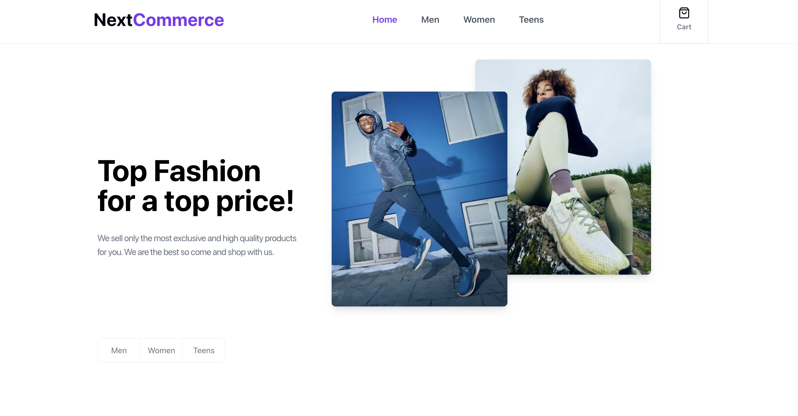
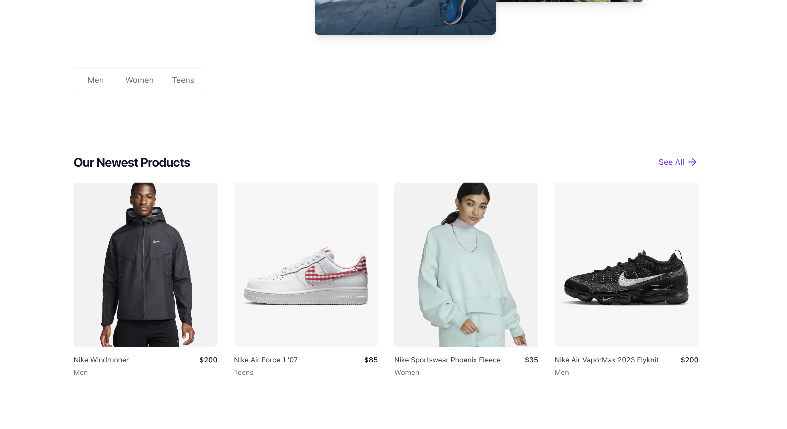
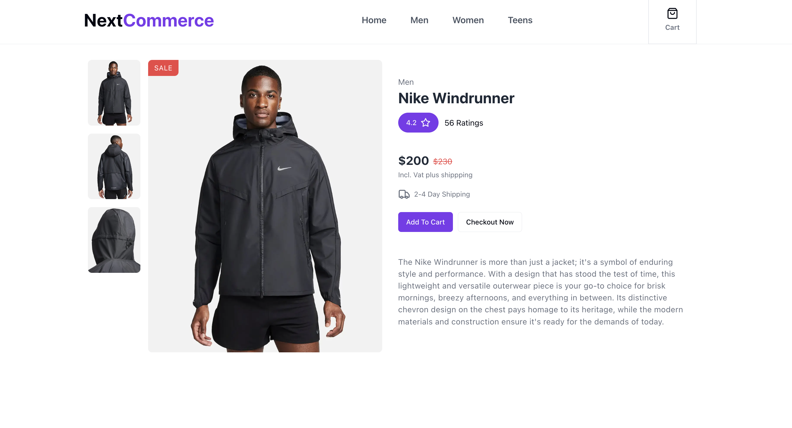
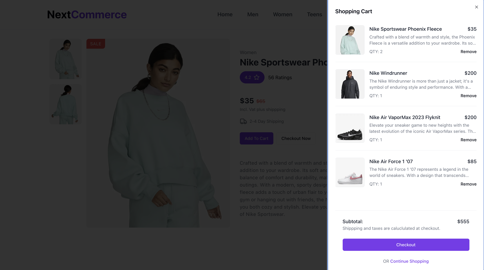

# E-Commerce Project with Next.js and Sanity

This project is an e-commerce website built with Next.js, utilizing Sanity as a headless CMS for content management and Stripe for payment processing. It features a product catalog, category management, and a customizable hero section.






## Live Demo

Check out the live demo of the project:

[**🚀 E-Commerce Demo Site**](https://e-commerce-three-sigma-45.vercel.app/)

## Tech Stack

- Next.js
- TypeScript
- Tailwind CSS
- Shadcn UI
- Sanity CMS
- Stripe (for payments)

## Getting Started

1. Clone the repository:

   ```
   git clone https://github.com/jukemori/e-commerce.git
   ```

2. Install dependencies:

   ```
   cd your-repo-name
   npm install
   ```

3. Set up environment variables:
   Create a `.env.local` file in the root directory and add the following:

   ```
   NEXT_PUBLIC_SANITY_PROJECT_ID=your_sanity_project_id
   NEXT_PUBLIC_SANITY_DATASET=your_sanity_dataset
   NEXT_PUBLIC_SANITY_API_VERSION=your_sanity_api_version
   NEXT_PUBLIC_STRIPE_KEY=your_stripe_public_key
   ```

4. Start the Next.js development server:

   ```
   npm run dev
   ```

5. Open [http://localhost:3000](http://localhost:3000) in your browser to see the result.

## Running the Sanity Studio

To run the Sanity Studio locally:

1. Navigate to the Sanity directory:

   ```
   cd sanity
   ```

2. Install Sanity Studio dependencies (if not already done):

   ```
   npm install
   ```

3. Start the Sanity Studio development server:

   ```
   npm run dev
   ```

4. Open [http://localhost:3333](http://localhost:3333) in your browser to access the Sanity Studio.

## Sanity Schema

Our Sanity schema includes the following content types:

1. **Product**: Represents products in the e-commerce store.

   - Fields: name, images, description, slug, price, price_id (Stripe), category

2. **Category**: Used to categorize products.

   - Fields: name

3. **HeroImages**: Stores two hero images for the homepage.
   - Fields: image1, image2

To modify the schema, edit the files in the `sanity/schemaTypes` directory.

## Stripe Integration

We use Stripe for payment processing. The Stripe public key is configured in the `.env.local` file.

To interact with Stripe, use the `NEXT_PUBLIC_STRIPE_KEY` environment variable in your client-side code.
